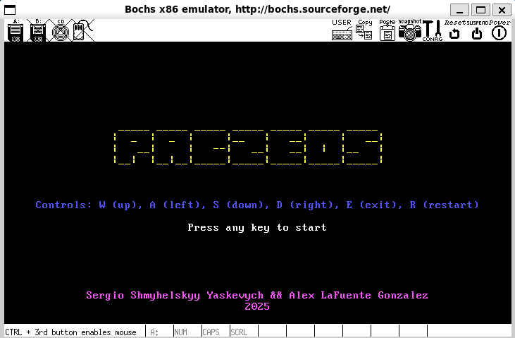
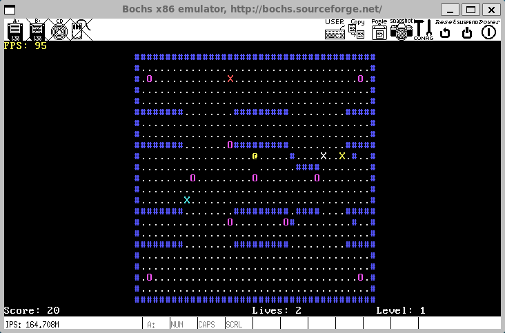

# 🎮 PacZeOS - Pacman Game on ZeOS Operating System

PacZeOS is a Pacman-inspired game built on top of the ZeOS, a custom x86 operating system kernel. This project demonstrates advanced operating system concepts including threading, synchronization, memory management, and real-time game development in a kernel environment.

#### 🏠 Menu Screen


#### 🎮 Gameplay


## 📋 Table of Contents
- [🔍 Overview](#overview)
- [💻 ZeOS Operating System](#zeos-operating-system)
- [🎯 Game Features](#game-features)
- [🏗️ Architecture](#architecture)
- [🧵 Threading Model](#threading-model)
- [🔄 Synchronization](#synchronization)
- [🧠 Memory Management](#memory-management)
- [⚙️ Game Mechanics](#game-mechanics)
- [📊 Performance](#performance)
- [🔧 Building and Running](#building-and-running)
- [💡 Technical Implementation](#technical-implementation)
- [📞 System Calls](#system-calls)
- [🤝 Contributing](#contributing)

## 🔍 Overview

PacZeOS combines the classic Pacman gameplay with sophisticated operating system programming. The game runs entirely in kernel space on a custom x86 operating system, showcasing:

- **🧵 Multi-threaded Architecture**: Separate threads for input handling and game logic
- **⚡ Real-time Performance**: FPS monitoring and optimized rendering
- **🔒 Advanced Synchronization**: Semaphore-based thread coordination with `sem_game` protecting shared data
- **🚀 Dynamic Level System**: Progressively expanding map sizes across levels
- **💾 Custom Memory Management**: Kernel-level memory allocation and page management

## 💻 ZeOS Operating System

ZeOS is a custom x86 operating system kernel featuring:

### 🧠 Core Components
- **🔋 Kernel**: Complete x86 kernel with interrupt handling, memory management, and scheduling
- **💾 Memory Management**: Paging-based virtual memory with frame allocation
- **👥 Process/Thread Management**: Support for both processes and threads with priority scheduling
- **⚡ Interrupt Handling**: Hardware interrupt management for keyboard, timer, and system calls
- **📞 System Calls**: Comprehensive system call interface with sysenter/sysexit optimization

### 🔑 Key Features
- **⏱️ Round-Robin Scheduler**: Priority-based scheduling with quantum management
- **📚 Page Table Management**: Virtual memory with user/kernel space separation
- **🔒 Semaphore Support**: Counting semaphores for thread synchronization
- **🖥️ Screen Management**: Direct video memory access for game rendering
- **⌨️ Keyboard Input**: Low-level keyboard interrupt handling
- **🔄 Process Isolation**: Separate memory spaces for different processes

## 🎯 Game Features

### 🎮 Core Gameplay
- **🕹️ Classic Pacman Mechanics**: Navigate mazes, collect food, avoid ghosts
- **⚡ Power Balls**: Temporarily make ghosts vulnerable
- **❤️ Multiple Lives**: Start with 3 lives, lose one when caught by ghosts
- **🏆 Score System**: Points for food (10), power balls (50), and eating ghosts (200)
- **📈 Progressive Levels**: 3 levels with increasing map complexity

### 🎨 Game Elements
- **😮 Pacman (@)**: Yellow player character with power-up color changes
- **👻 Ghosts (X)**: Four different colored ghosts with unique behaviors:
  - **👻 Blinky (Red)**: Aggressive chaser
  - **👻 Pinky (Pink)**: Strategic ambusher
  - **👻 Inky (Cyan)**: Unpredictable patroller
  - **👻 Clyde (Yellow)**: Opportunistic hunter
- **🧱 Walls (#)**: Blue maze boundaries
- **🍪 Food (.)**: White dots worth 10 points each
- **💊 Power Balls (O)**: Magenta special items worth 50 points
- **🎨 Color Scheme**:
  - **🎨 Pacman**: Yellow (normal), Magenta (powered)
  - **🎨 Ghosts**: Red, Pink, Cyan, Yellow (normal), Magenta (frightened)
  - **🎨 Walls**: Blue
  - **🎨 Food**: White
  - **🎨 Power Balls**: Magenta

## 🎮 Game Controls

### 🎯 Movement Controls
- **⬆️ W**: Move Up
- **⬇️ S**: Move Down
- **⬅️ A**: Move Left
- **➡️ D**: Move Right

### 🎮 Game Controls
- **🔄 R**: Restart Game
- **🚪 E**: Exit Game

## 🏆 Scoring System

### 💰 Points
- **🍪 Food**: 10 points
- **💊 Power Ball**: 50 points
- **👻 Ghost Eaten**: 200 points

### 🎯 Level Progression
- **1️⃣ Level 1**: Basic map (39 width)
- **2️⃣ Level 2**: Medium map
- **3️⃣ Level 3**: Large map (78 width)

### 🏆 Victory Conditions
- Collect all food in all levels
- Survive with remaining lives
- Achieve highest possible score

## 🏗️ Architecture

### System Architecture
```
┌─────────────────────────────────────────┐
│               User Space                │
├─────────────────────────────────────────┤
│  PacZeOS Game Application (user.c)      │
│  ├─ Input Thread (High Priority: 35)    │
│  ├─ Game Thread (Medium Priority: 25)   │
│  └─ Main Thread (Low Priority: 1)       │
├─────────────────────────────────────────┤
│            System Calls                 │
│  ├─ Threading (clone, pthread_*)        │
│  ├─ Synchronization (sem_*)             │
│  ├─ I/O (keyboard, screen)              │
│  └─ Memory (allocation, mapping)        │
├─────────────────────────────────────────┤
│              ZeOS Kernel                │
│  ├─ Scheduler (sched.c)                 │
│  ├─ Memory Manager (mm.c)               │
│  ├─ Interrupt Handler (interrupt.c)     │
│  ├─ System Call Handler (sys.c)         │
├─────────────────────────────────────────┤
│               Hardware                  │
│  ├─ x86 Processor                       │
│  ├─ VGA Text Mode (80x25)               │
│  ├─ Keyboard Controller                 │
│  └─ Timer (18.2 Hz)                     │
└─────────────────────────────────────────┘
```

## 🧵 Threading Model

### Thread Architecture
PacZeOS uses a multi-threaded design with specialized thread roles:

1. **🎮 Input Thread** (Priority: 35 - Highest)
   - Handles keyboard input processing
   - Updates Pacman direction based on WASD keys
   - Processes global commands (Escape, Reset)
   - Minimal processing to ensure responsiveness

2. **🎲 Game Thread** (Priority: 25 - Medium)
   - Main game logic processing
   - Ghost AI and movement
   - Collision detection
   - Score and state management
   - Rendering pipeline
   - FPS calculation and display

3. **⚙️ Main Thread** (Priority: 1 - Lowest)
   - Initial setup and configuration
   - Thread creation and management
   - Cleanup and termination handling

### 📢 Thread Communication
- Threads share game state through global variables
- Semaphore-based mutual exclusion (`sem_game`) prevents race conditions
- Both Input Thread and Game Thread use the same semaphore to protect critical sections
- No blocking operations in high-priority threads to maintain responsiveness

## 🔄 Synchronization

### 🔒 Semaphore System
The game uses ZeOS's semaphore implementation for thread synchronization:

```c
// Binary semaphore for game state protection
int game_sem = sem_init(1);  // Global semaphore shared between threads

// Critical section protection
sem_wait(game_sem);          // Lock access to shared data
// ... modify game state (Pac-Man position, ghost positions, score, etc.) ...
sem_post(game_sem);          // Release lock when done
```

Both the Input Thread and Game Thread use `sem_game` to ensure that shared data (like Pac-Man's position, ghost positions, and game state) is never accessed simultaneously, preventing race conditions and ensuring data integrity.

### 🔄 Synchronization Points
- **🎮 Game State Updates**: Protected by `sem_game` during rendering and logic updates
- **⌨️ Input Processing**: Atomic updates to player direction
- **🖥️ Screen Access**: Synchronized access to video memory
- **📊 Shared Data**: All accesses to game state are protected

## 🧠 Memory Management

### Memory Layout
```
Virtual Memory Space:
┌─────────────────────┐ 0xFFFFFFFF
│    Kernel Space     │
├─────────────────────┤ 0xC0000000
│   Thread Stacks     │
├─────────────────────┤
│    Screen Buffer    │
├─────────────────────┤
│    Game Data        │
├─────────────────────┤
│    User Code        │
├─────────────────────┤ 0x00000000
│    System Code      │
└─────────────────────┘
```

### 💾 Memory Features
- **📚 Dynamic Stack Allocation**: Custom stack sizes for threads
- **🖥️ Screen Memory Mapping**: Direct access to VGA text buffer
- **📄 Page-based Management**: 4KB pages with demand allocation
- **🛡️ Memory Protection**: User/kernel space separation

## ⚙️ Game Mechanics

### 🎚️ Level Progression
- **1️⃣ Level 1**: Basic map size (39 width)
- **2️⃣ Level 2**: Expanded map size
- **3️⃣ Level 3**: Maximum map size (78 width)
- **🏆 Victory**: Complete all levels by collecting all food

### 👻 Ghost AI Behavior
The game features sophisticated ghost AI with multiple states:

1. **😈 Normal State**: Chase Pacman using distance-based pathfinding
2. **😱 Frightened State**: Flee from Pacman when power ball is active
3. **👻 Dead State**: Return to spawn point and respawn

### 🎯 Collision Detection
- **Enhanced Collision System**: Detects direct collisions and position swapping
- **Wall Collision**: Prevents movement through maze walls
- **Food Collection**: Automatic pickup and score updates
- **Ghost Interactions**: Context-sensitive based on power ball state

### 🗺️ Map Generation
- **Procedural Layout**: Dynamically generated maze patterns
- **Strategic Power Ball Placement**: Corner and center positions
- **Adaptive Sizing**: Maps scale with level progression
- **Boundary Wrapping**: Horizontal movement wraps around screen edges

## 📊 Performance

### 🎯 FPS System
The game implements real-time FPS monitoring:
- **Target Rate**: ~15 FPS (limited by 18.2 Hz timer)
- **Frame Counting**: Tracks frames per timing interval
- **Performance Display**: Real-time FPS shown on screen
- **Optimization**: Minimal processing in critical paths

### ⏱️ Timing Constants
```c
#define TICKS_PER_SECOND 1800      // System timer frequency
#define TICKS_PER_GAME_UPDATE 120  // Game update interval
```

### 🚀 Performance Optimizations
- **Priority-based Scheduling**: High priority for input responsiveness
- **Efficient Rendering**: Direct video memory access
- **Minimal Memory Allocation**: Static allocation where possible
- **Optimized Collision Detection**: Early termination conditions

## 🔧 Building and Running

### 📋 Prerequisites
- **Build Environment**: x86 cross-compilation toolchain
- **Emulator**: QEMU or similar x86 emulator
- **Make**: Standard build system

### 🛠️ Build Process
```bash
# Navigate to project directory
cd /path/to/zeos

# Build the kernel and game
make

# Run in Bochs emulator
make emul
```

### 💻 System Requirements
- **Architecture**: x86-compatible processor
- **Memory**: Minimum 16MB RAM
- **Display**: VGA-compatible text mode support
- **Input**: PS/2 keyboard support

## Technical Implementation

### Key Files Structure
```
zeos/
├── user.c              # Main game implementation
├── user-utils.S        # Assembly system call wrappers
├── sys.c               # System call implementations
├── sched.c             # Scheduler and threading
├── mm.c                # Memory management
├── interrupt.c         # Interrupt handlers
├── include/
│   ├── sched.h         # Task and semaphore structures
│   └── ...
└── README.md           # This file
```

### Game Constants
```c
// Screen dimensions
#define SCREEN_WIDTH 80
#define SCREEN_HEIGHT 25

// Game timing
#define POWER_BALL_DURATION 150
#define GHOST_RESPAWN_TIME 100

// Scoring
#define FOOD_POINTS 10
#define POWER_BALL_POINTS 50
#define GHOST_POINTS 200
```

### Color Scheme
- **Pacman**: Yellow (0x0E00) / Magenta when powered (0x0D00)
- **Ghosts**: Red, Pink, Cyan, Yellow (Blinky, Pinky, Inky, Clyde)
- **Walls**: Blue (0x0900)
- **Food**: White (0x0F00)
- **Power Balls**: Magenta (0x0D00)

## System Calls

### Threading System Calls
```c
int pthread_create(void *(*func)(void*), void *param, int stack_size);
int pthread_exit();
int SetPriority(int priority);
```

### Synchronization System Calls
```c
int sem_init(int value);
int sem_wait(int sem_id);
int sem_post(int sem_id);
int sem_destroy(int sem_id);
```

### I/O System Calls
```c
int GetKeyboardState(char *keyboard);
int pause(int milliseconds);
void *StartScreen();
```

### Core System Calls
```c
int gettime();
int getpid();
int write(int fd, char *buffer, int size);
```

## Game Controls

### Player Controls
- **W**: Move up
- **A**: Move left
- **S**: Move down
- **D**: Move right

### System Controls
- **R**: Restart game (cheat code - works during gameplay)
- **E**: Exit/Escape
- **Any Key**: Start from menu

### Gameplay Rules
- Collect all food dots to advance to the next level
- Avoid ghosts unless you have a power ball active
- Eat power balls to temporarily make ghosts vulnerable
- Complete all 3 levels to win the game

## Contributing

This project serves as an educational demonstration of operating system concepts and game development in kernel space. Key areas for potential enhancement:

1. **Graphics**: Upgrade to pixel-based graphics mode
2. **Audio**: Add sound effects and music
3. **Networking**: Multi-player support
4. **File System**: Save/load game states
5. **Additional Levels**: More complex maze designs

## Technical Notes

### Assembly Integration
The project demonstrates direct assembly programming with system call wrappers that interface between C code and kernel system calls using the sysenter/sysexit mechanism.

### Real-time Constraints
The game operates under real-time constraints typical of embedded systems, making it an excellent example of real-time programming in an operating system context.

### Educational Value
PacZeOS showcases advanced computer science concepts:
- Operating system design and implementation
- Multi-threading and synchronization
- Memory management and virtual memory
- Interrupt handling and device drivers
- Real-time system programming

---

**Authors**: Sergio Shmyhelskyy && Alex Lafuente Gonzalez
**Year**: 2024-2025  
**License**: Educational use

This project demonstrates the intersection of operating system development and game programming, providing hands-on experience with kernel-level programming, threading, synchronization, and real-time system design.
